# 저평가 우량주 조준장 포트폴리오

**저평가 우량주 포트폴리오**는 Kotlin Multiplatform 기반으로 개발된 웹 포트폴리오입니다. Android에서의 Compose 개발 경험을 웹 환경으로 자연스럽게 확장하고자 시작한 프로젝트로, Kotlin/Wasm을 통해 브라우저에서 직접 실행 가능한 구조를 갖추었습니다.

<table>
  <tr>
    <td>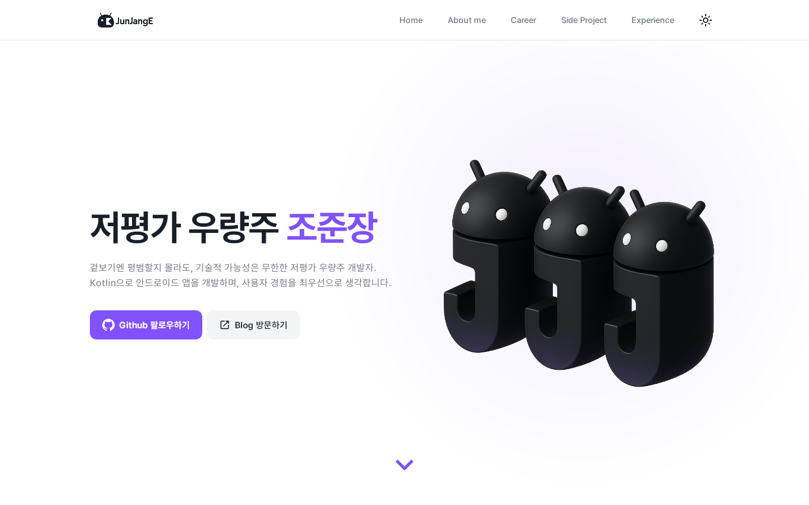</td>
    <td>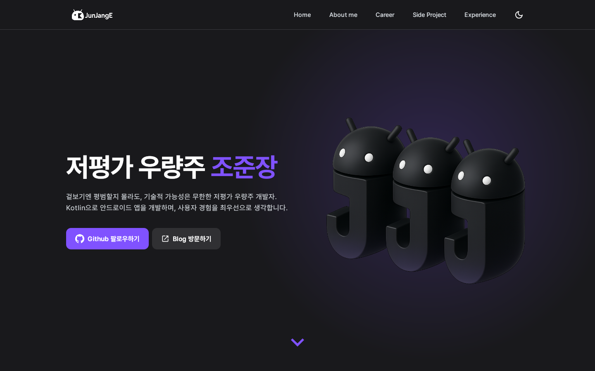</td>
  </tr>
  <tr>
    <td>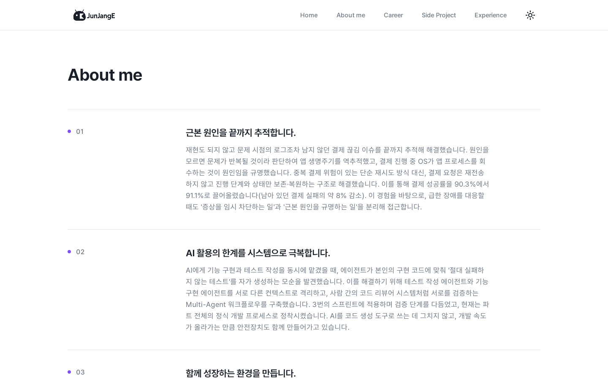</td>
    <td>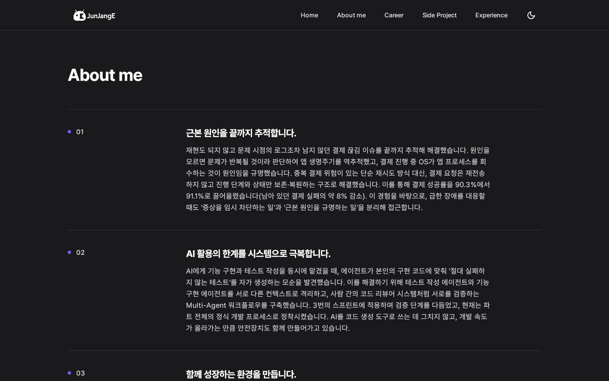</td>
  </tr>
  <tr>
    <td>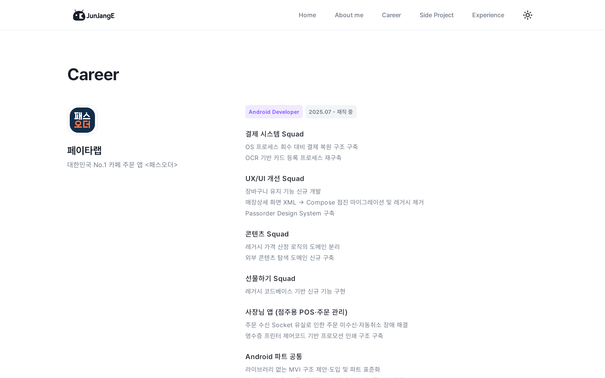</td>
    <td>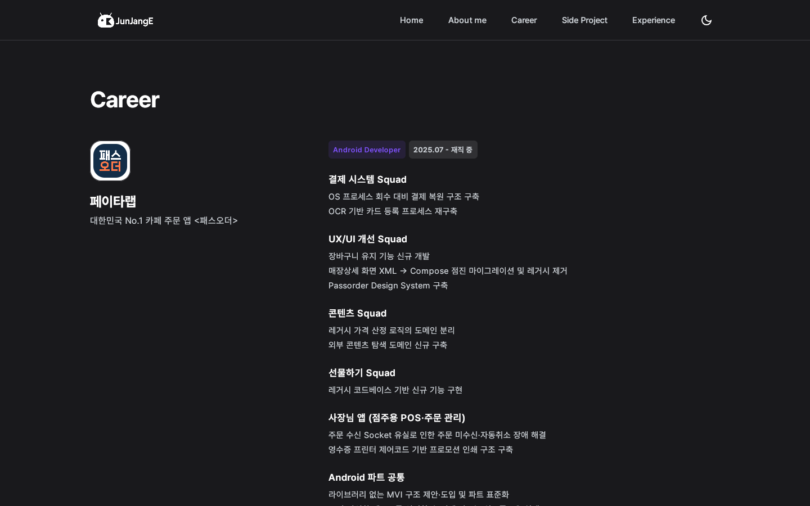</td>
  </tr>
  <tr>
    <td>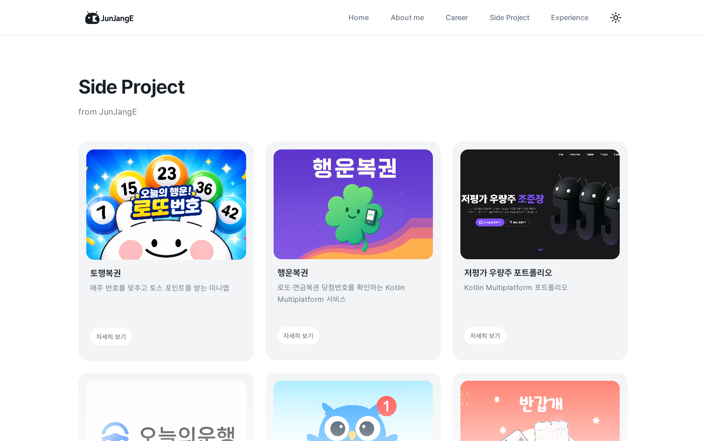</td>
    <td>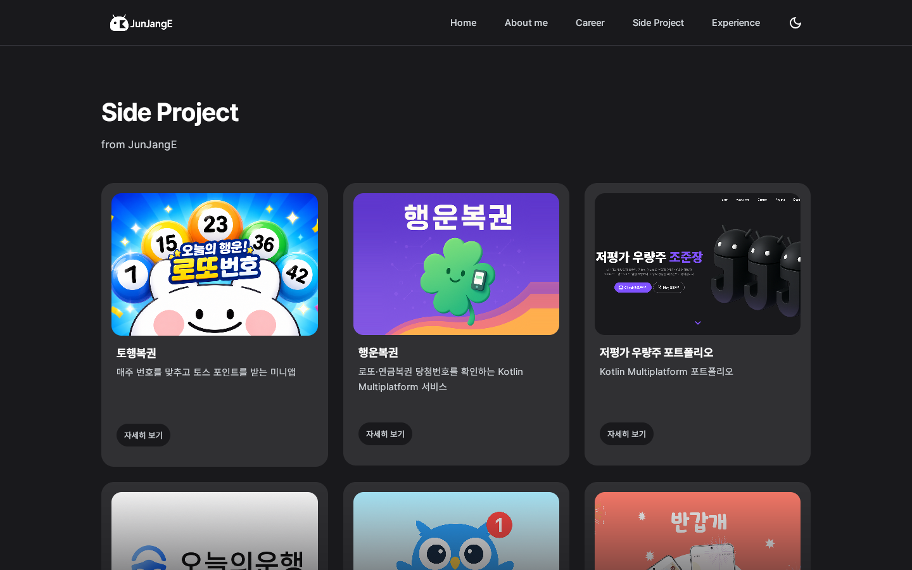</td>
  </tr>
  <tr>
    <td>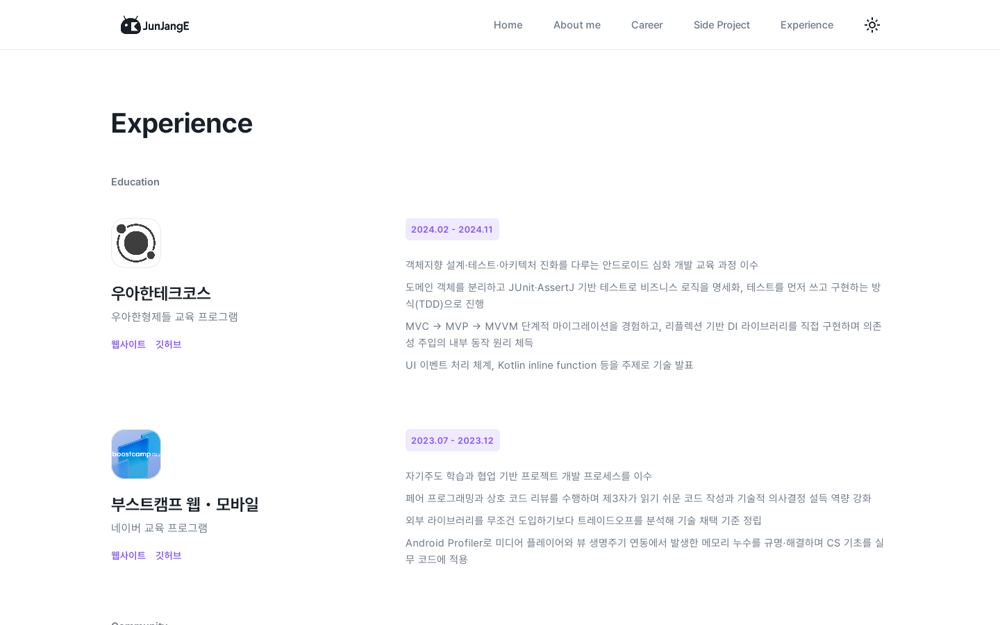</td>
    <td>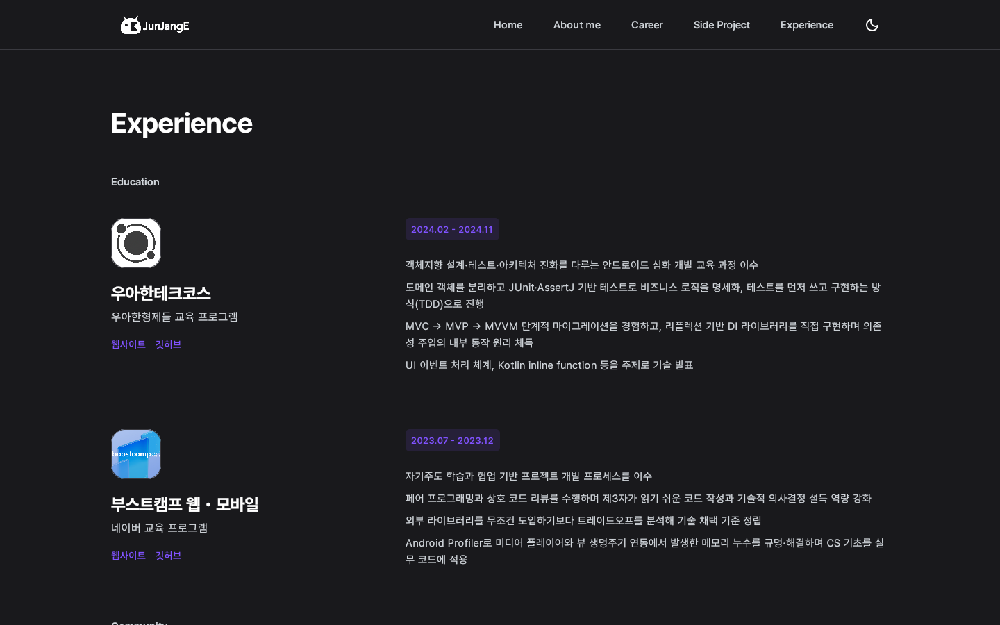</td>
  </tr>
  <tr>
    <td>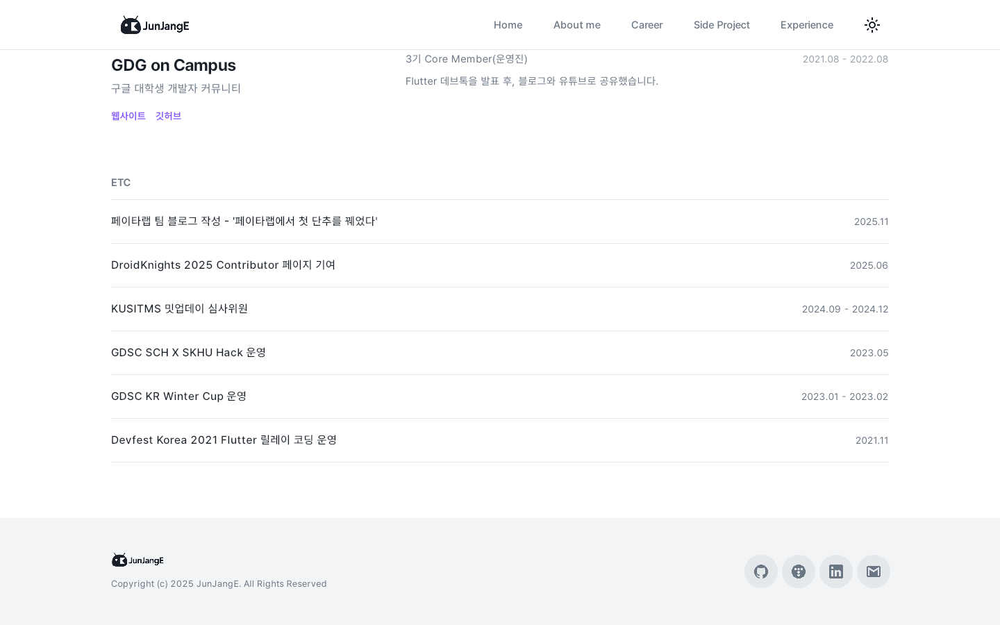</td>
    <td>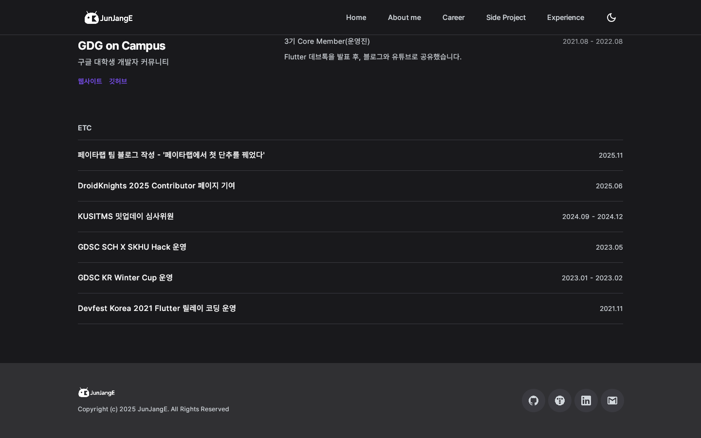</td>
  </tr>
</table>
